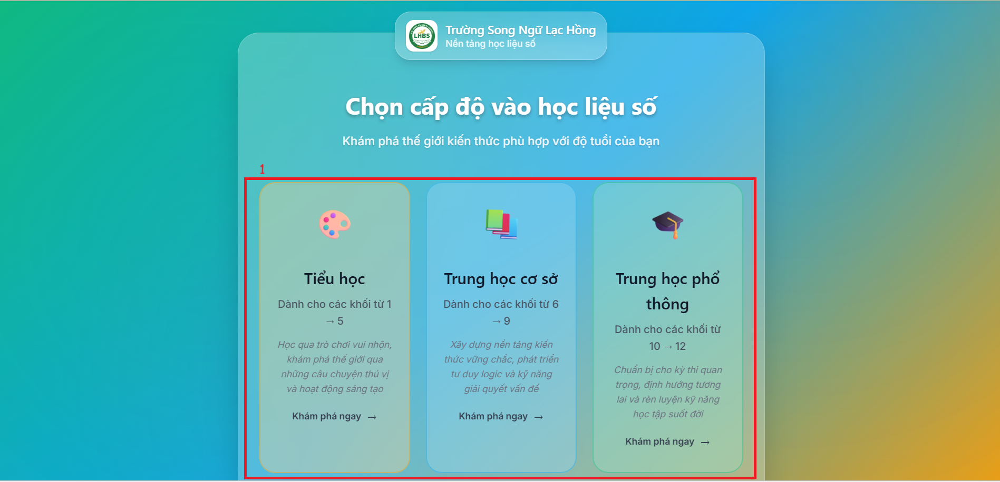

# TRANG CHỦ
### I. Trang chủ
  
__Chức năng:__
1. Các cấp độ để người dùng chọn  

__Mô tả:__ Người dùng chọn cấp độ học

### II. Chọn học liệu
#### 1. Cấp 1 (Tiểu học)
  
__Chức năng:__
1. : Chọn để hiện thị những học liệu có trong Khối này
2. Vùng chọn học liệu

__Mô tả:__ Người dùng chọn học liệu

#### 1. Cấp 2 (THCS)
  
__Chức năng:__
1. : Chọn để hiện thị những học liệu các lớp có trong môn này
2. Vùng chọn học liệu

__Mô tả:__ Người dùng chọn học liệu

#### 1. Cấp 3 (THPT)
  
__Chức năng:__
1. : Chọn để hiện thị những học liệu các lớp có trong môn này
2. Vùng chọn học liệu

__Mô tả:__ Người dùng chọn học liệu

### III. Chi tiết học liệu

__Chức năng:__
1. Tên học liệu
2. Vùng chọn các Chương có trong học liệu
3. Vùng chọn nội dung trong Chương

__Mô tả:__ Người dùng có thể chọn Chương và xem các nội dung có trong Chương