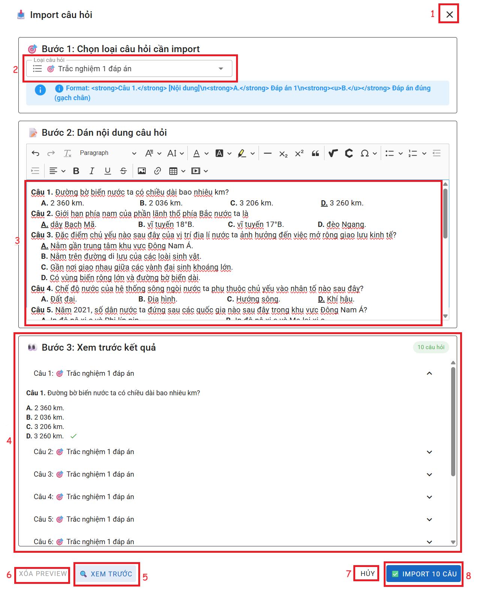
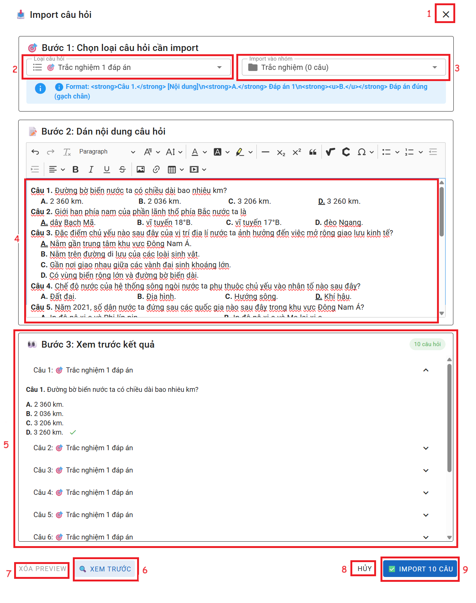

# BÀI THI 

<a href="/docs-lms/docs/files/Bai-thi-mau.docx" download>📄 Tải file mẫu</a>

### I. Bài thi không phân nhóm
#### Trang chính

  
  

__Chức năng:__ 
1. : Đóng cửa sổ thêm
2. : Nhập tên mục
3. : Chọn loại nội dung
4. : Nhập thứ tự
5. Vùng nhập tiêu đề bài thi
6. Nhập thời gian cho bài thi
7. Điểm tối đa của bài thi
8. Điểm tối thiểu để đạt
9. : Bật để phân nhóm bài thi
10. : Mở cửa sổ thêm câu hỏi đã có file sẵn  
11. : Xem câu tiếp theo hoặc câu trước  
12. : Xóa câu hỏi  
13. : Chỉnh sửa câu hỏi  
14. Nhập điểm cho câu hỏi  
15. : Chọn loại câu hỏi  
16. Vùng chỉnh sửa câu hỏi. (Với mỗi loại câu hỏi thì giao diện sẽ thay đổi. Ấn chọn loại câu hỏi bên trái để xem chi tiết)  
17. Vùng nhập giải thích đáp án  
18. Các câu hỏi khác có trong bộ  
19. : Chọn loại câu hỏi để thêm 1 câu hỏi  
20. : Thêm 1 câu hoi với loại đã chọn. (Cách thêm mỗi loại câu hỏi ân bên trái để xem chi tiết)  
21. : Đóng cửa sổ thêm  
22. : Lưu mục  

__Mô tả:__ Người dùng soạn bài thi có phân nhóm

#### Trang Import nhiều câu hỏi
  
__Chức năng:__ 
1. : Đóng cửa sổ thêm 
2. : Chọn loại câu hỏi
3. Vùng copy câu hỏi vào (Theo format yêu cầu)
4. Vùng xem trước câu hỏi
5. : Ấn để xem trước các câu hỏi đã thêm
6. : Ẩn xem trước các câu hỏi
7. : Đóng cửa sổ thêm  
8. : Thêm các câu hỏi vô nhóm

### II. Bài thi có phân nhóm
#### Trang chính

  
  

__Chức năng:__ 
1. : Đóng cửa sổ thêm
2. : Nhập tên mục
3. : Chọn loại nội dung
4. : Nhập thứ tự
5. Vùng nhập tiêu đề bài thi
6. Nhập thời gian cho bài thi
7. Điểm tối đa của bài thi
8. Điểm tối thiểu để đạt
9. : Tắt để không phân nhóm bài thi
10. : Thêm nhóm 

 11 và 12. Các nhóm đã thêm  
13.  : Nhập tên nhóm  
14. : Nhập thời gian làm của nhóm  
15. : Nhập tổng điểm của nhóm  
16. Nhập mô tả cho nhóm  
17. Nhập hướng dẫn làm bài  
18. : Mở cửa sổ thêm câu hỏi đã có file sẵn  
19. : Xem câu tiếp theo hoặc câu trước  
20. : Xóa câu hỏi  
21. : Chỉnh sửa câu hỏi  
22. Nhập điểm cho câu hỏi  
23. : Chọn loại câu hỏi  
24. Vùng chỉnh sửa câu hỏi. (Với mỗi loại câu hỏi thì giao diện sẽ thay đổi. Ấn chọn loại câu hỏi bên trái để xem chi tiết)  
25. Vùng nhập giải thích đáp án  
26. Các câu hỏi khác có trong bộ  
27. : Chọn loại câu hỏi để thêm 1 câu hỏi  
28. : Thêm 1 câu hoi với loại đã chọn. (Cách thêm mỗi loại câu hỏi ân bên trái để xem chi tiết)    
29. : Đóng cửa sổ thêm  
30. : Lưu mục  

__Mô tả:__ Người dùng soạn bài thi có phân nhóm

#### Trang Import nhiều câu hỏi
  
__Chức năng:__ 
1. : Đóng cửa sổ thêm 
2. : Chọn loại câu hỏi
3. : Chọn nhóm để thêm các câu hỏi
4. Vùng copy câu hỏi vào (Theo format yêu cầu)
5. Vùng xem trước câu hỏi
6. : Ấn để xem trước các câu hỏi đã thêm
7. : Ẩn xem trước các câu hỏi
8. : Đóng cửa sổ thêm  
9. : Thêm các câu hỏi vô nhóm