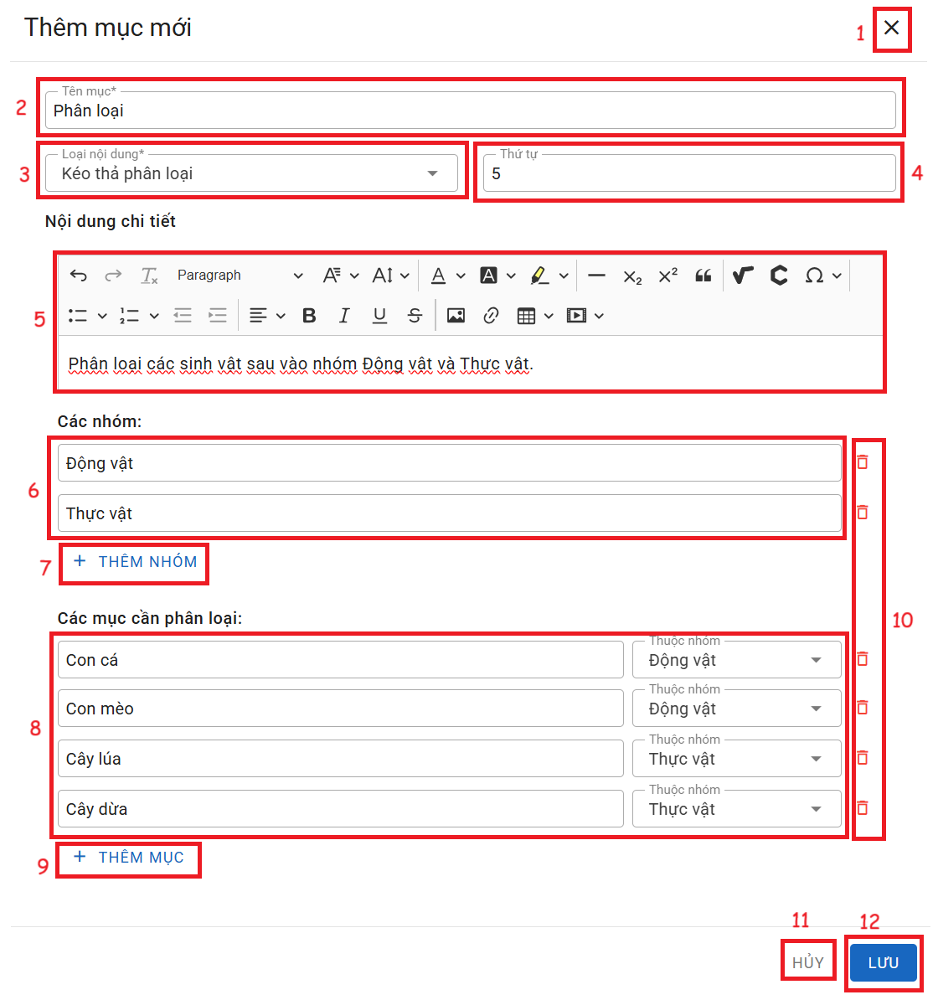

# KÉO THẢ PHÂN LOẠI

__Chức năng:__ 
1. : Đóng cửa sổ thêm
2. : Nhập tên mục
3. : Chọn loại nội dung
4. : Nhập thứ tự
5. Vùng nhập nội dung câu hỏi
6. Vùng nhập các nhóm phân loại
7. : Thêm nhóm phân loại
8. Vùng nhập các mục để phân loại vào nhóm (: chọn nhóm mà mục đó thuộc về)
9. : Thêm mục
10. : Xóa nhóm, mục tương ứng
11. : Đóng cửa sổ thêm
12. : Lưu mục  

__Mô tả:__ Người dùng soạn câu hỏi phân loại
