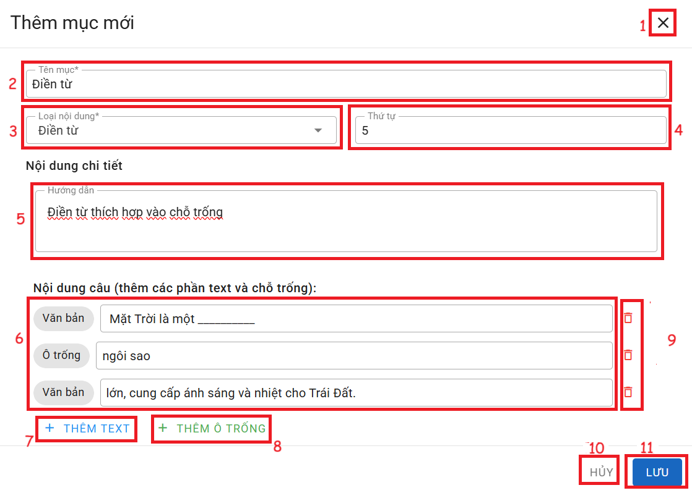

# ĐIỀN TỪ

__Chức năng:__ 
1. : Đóng cửa sổ thêm
2. : Nhập tên mục
3. : Chọn loại nội dung
4. : Nhập thứ tự
5. Vùng nhập nội dung câu hỏi
6. Vùng nhập câu hỏi và đáp án (: câu hỏi, : đáp án chỗ trống)
7. : Thêm câu hỏi
8. : Thêm đáp án chỗ trống
19. : Xóa nhóm, mục tương ứng
10. : Đóng cửa sổ thêm
11. : Lưu mục  

__Mô tả:__ Người dùng soạn câu hỏi dạng điền vào chỗ trống
