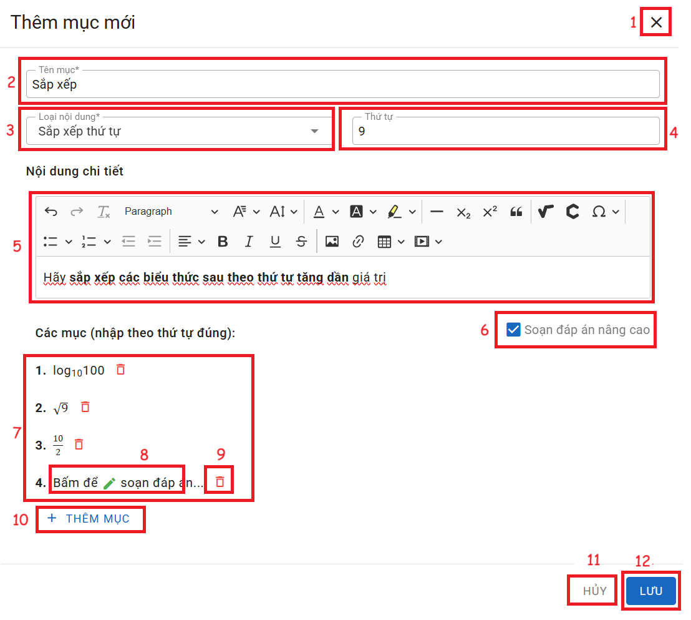

# SẮP XẾP
### I. Sắp xếp có câu trả lời đơn giản

__Chức năng:__ 
1. : Đóng cửa sổ thêm
2. : Nhập tên mục
3. : Chọn loại nội dung
4. : Nhập thứ tự
5. Vùng nhập nội dung câu hỏi
6. : Tích vào để soạn các đáp án phức tạp
7. Vùng nhập đáp ăn theo thứ tự đúng
8. : Xóa đáp án
9. : Thêm mục
10. : Đóng cửa sổ thêm
11. : Lưu mục  

__Mô tả:__ Người dùng soạn câu hỏi sắp xếp đơn giản

### II. Sắp xếp có câu trả lời nâng cao

__Chức năng:__ 
1. : Đóng cửa sổ thêm
2. : Nhập tên mục
3.  Chọn loại nội dung
4. : Nhập thứ tự
5. Vùng nhập nội dung câu hỏi
6. : Bỏ tích vào để soạn các đáp án dơn giản
7. Vùng nhập đáp ăn theo thứ tự đúng

8. : Bấm vào để soạn đáp án

9. : Xóa đáp án
10. : Thêm mục
11. : Đóng cửa sổ thêm
12. : Lưu mục  

__Mô tả:__ Người dùng soạn câu hỏi sắp xếp có câu trả lời phức tạp như biểu thức phép toán
