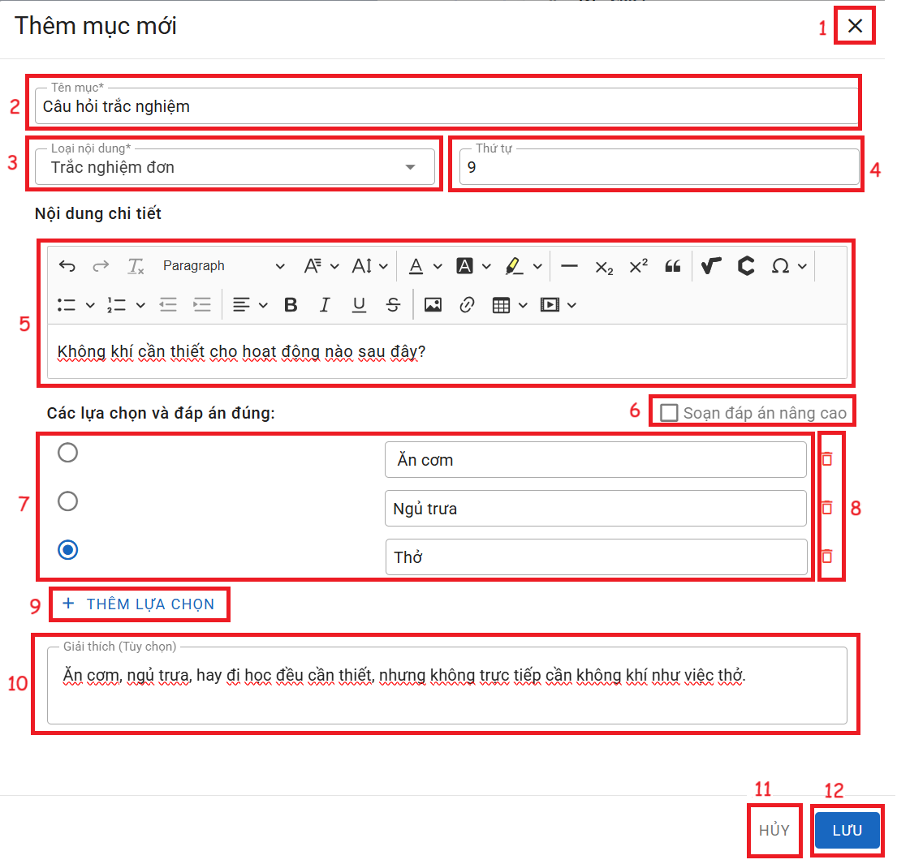
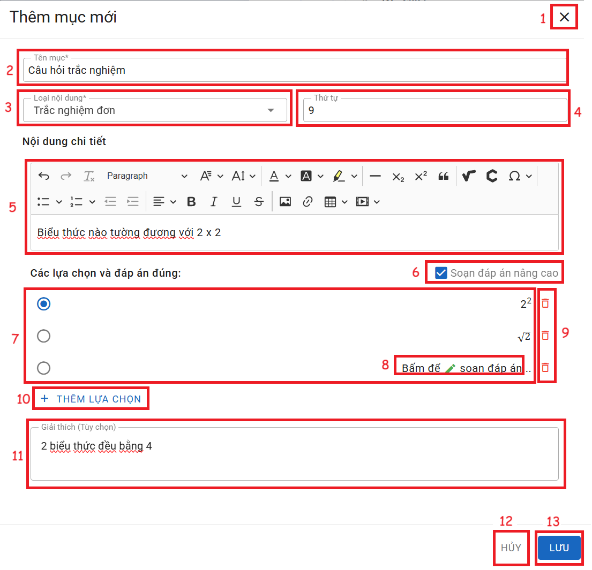

# TRẮC NGHIỆM ĐƠN
### I. Trắc nghiệm câu trả lời đơn giản

__Chức năng:__ 
1. : Đóng cửa sổ thêm
2. : Nhập tên mục
3. : Chọn loại nội dung
4. : Nhập thứ tự
5. Vùng nhập nội dung câu hỏi
6. : Tích vào để soạn các đáp án phức tạp
7. Vùng nhập đáp án và chọn đáp án đúng
(: Đáp án đúng)

8. : Xóa đáp án
9. : Thêm lựa chọn đáp án
10. Vùng nhập lời giải thích đáp án
11. : Đóng cửa sổ thêm
12. : Lưu mục  

__Mô tả:__ Người dùng soạn câu trắc nghiệm có câu trả lời đơn giản

### II. Trắc nghiệm câu trả lời nâng cao

__Chức năng:__ 
1. : Đóng cửa sổ thêm
2. : Nhập tên mục
3. : Chọn loại nội dung
4. : Nhập thứ tự
5. Vùng nhập nội dung câu hỏi
6. : Bỏ tích vào để soạn các đáp án dơn giản
7. Vùng nhập đáp án và chọn đáp án đúng
(: Đáp án đúng)

8. : Bấm vào để soạn đáp án

9. : Xóa đáp án
10. : Thêm lựa chọn đáp án
11. Vùng nhập lời giải thích đáp án
12. : Đóng cửa sổ thêm
13. : Lưu mục  

__Mô tả:__ Người dùng soạn câu trắc nghiệm có câu trả lời phức tạp như biểu thức phép toán
