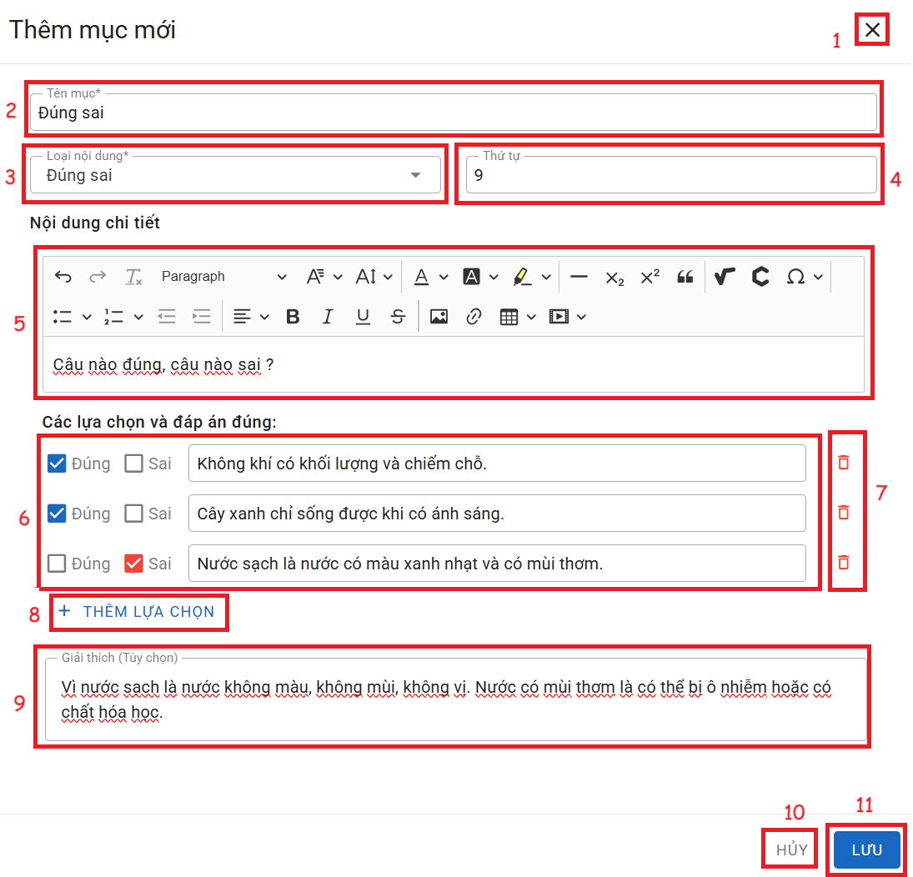

# ĐÚNG / SAI

__Chức năng:__ 
1. : Đóng cửa sổ thêm
2. : Nhập tên mục
3. : Chọn loại nội dung
4. : Nhập thứ tự
5. Vùng nhập nội dung câu hỏi
6. Vùng nhập đáp án và chọn đáp án đúng
(: Đáp án đúng, : Đáp án sai)

7. : Xóa đáp án
8. : Thêm lựa chọn đáp án
9. Vùng nhập lời giải thích đáp án
10. : Đóng cửa sổ thêm
11. : Lưu mục  

__Mô tả:__ Người dùng soạn câu hỏi dạng đúng / sai
