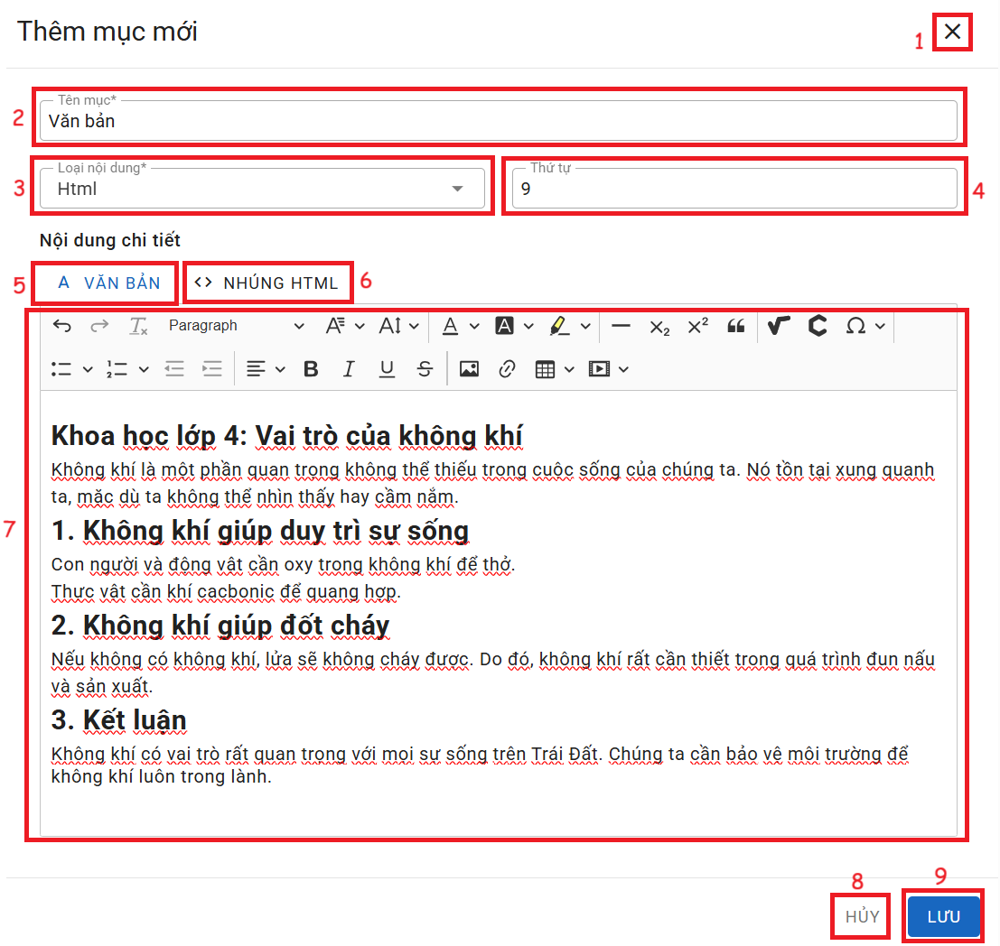

# VĂN BẢN HOẶC HTML

  
__Chức năng:__ 
1. : Đóng cửa sổ thêm
2. : Nhập tên mục
3. : Chọn loại nội dung
4. : Nhập thứ tự
5. Nhập nội dung dạng Văn Bản
 

6. Nhập nội dung dạng HTML 

7. Vùng nhập nội dung.
8. : Đóng cửa sổ thêm
9. : Lưu mục  

__Mô tả:__ Người dùng thêm nội dung dạng Văn Bản hoặc HTML
