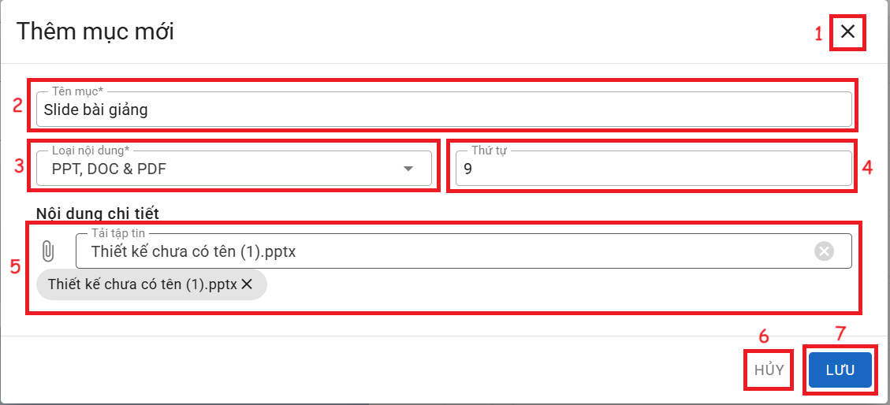

# SLIDE

  
__Chức năng:__ 
1. : Đóng cửa sổ thêm
2. : Nhập tên mục
3. : Chọn loại nội dung
4. : Nhập thứ tự
5. : Chọn file có trên máy và file đã chọn
6. : Đóng cửa sổ thêm
7. : Lưu mục  

__Mô tả:__ Người dùng thêm nội dung dạng PPT, DOC & PDF  
*Lưu ý:  Học liệu sẽ được lưu trên ggdrive của nhà trường.*