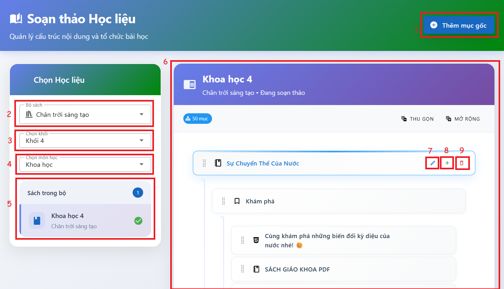
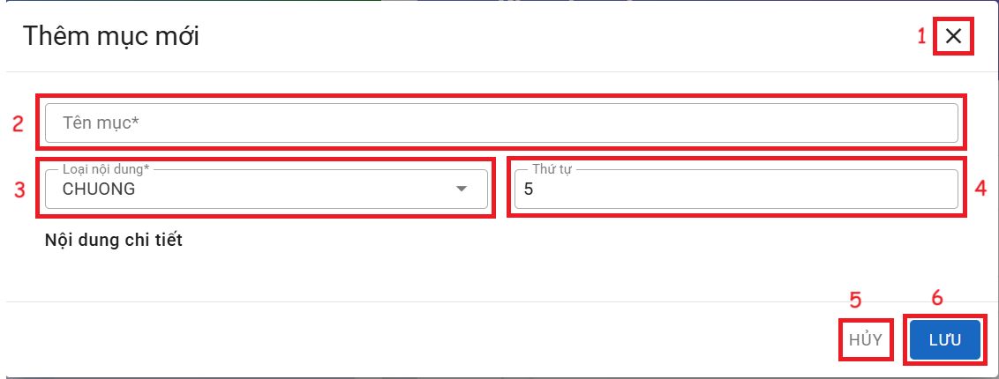
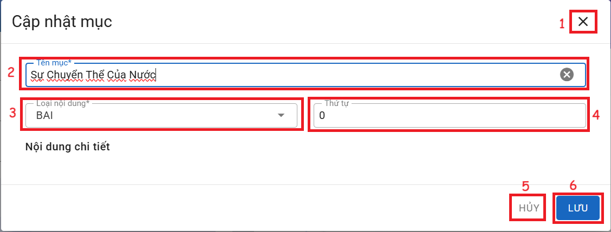
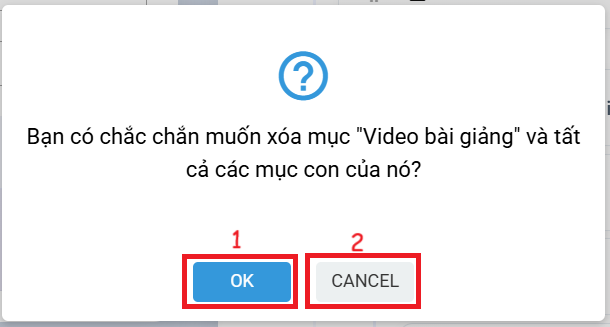

# TRANG CHỦ
### I. Trang chủ
  
__Chức năng:__ 
1. : Mở của sổ thêm vào mục gốc
2. : Chọn bộ sách
3. :Chọn khối
4. : Chọn môn
5. Sách trong bộ: Chọn sách có trong bộ
6. Vùng soạn học liệu
7. : Sửa mục
8. : Thêm mục con
9. : Xóa mục

__Mô tả:__ Người dùng chọn sách để soạn học liệu

### II. Thêm mục gốc
  
__Chức năng:__  
1. : Đóng cửa sổ thêm
2. : Nhập tên mục
3. : Chọn loại nội dung
4. : Nhập thứ tự
5. : Đóng cửa sổ thêm
6. : Lưu mục  

*Đối với các nội dung khác nhau cửa sổ sẽ thay đổi. Chọn nội dung muốn thêm bên trái để xem chi tiết*  
__Mô tả:__ Người dùng thêm mục gốc như Chương, bài, kỹ năng.

### III. Cập nhật mục
  
__Chức năng:__  
1. : Đóng cửa sổ cập nhật
2. : Cập nhật tên mục
3. : Cập nhật loại nội dung
4. : Nhập thứ tự
5. : Đóng cửa sổ cập nhật
6. : Lưu cập nhật

### IV. Thêm mục con  
*Tương tự như thêm mục gốc*
  
__Chức năng:__  
1. : Đóng cửa sổ thêm
2. : Nhập tên mục
3. : Chọn loại nội dung
4. : Nhập thứ tự
5. : Đóng cửa sổ thêm
6. : Lưu mục

*Đối với các nội dung khác nhau cửa sổ sẽ thay đổi. Chọn nội dung muốn thêm bên trái để xem chi tiết*  
__Mô tả:__ Người dùng thêm mục con như bài, kỹ năng.

### V. Xóa mục

  
__Chức năng:__  
1. : Xóa mục
2. : Đóng cửa sổ và không xóa mục

*Khi xóa mục sẽ đồng thời xóa hết các mục con hiện có trong mục*  
__Mô tả:__ Người dùng xóa thể xóa mục