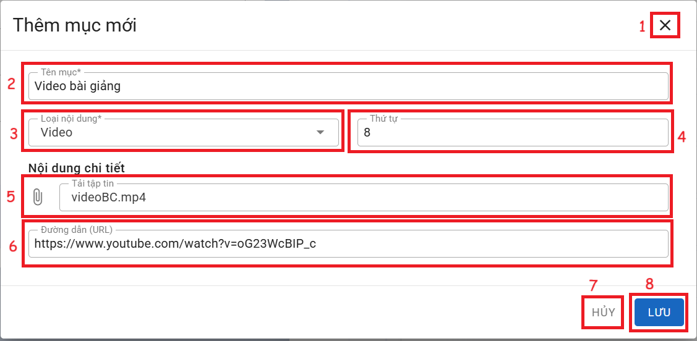

# VIDEO

  
__Chức năng:__ 
1. : Đóng cửa sổ thêm
2. : Nhập tên mục
3. : Chọn loại nội dung
4. : Nhập thứ tự
5. : Chọn video có trên máy
6. : Dán link video trên Youtube
7. : Đóng cửa sổ thêm
8. : Lưu mục  

__Mô tả:__ Người dùng thêm nội dung dạng Video  
*Lưu ý:  Học liệu sẽ được lưu trên kênh Youtube của nhà trường.*
